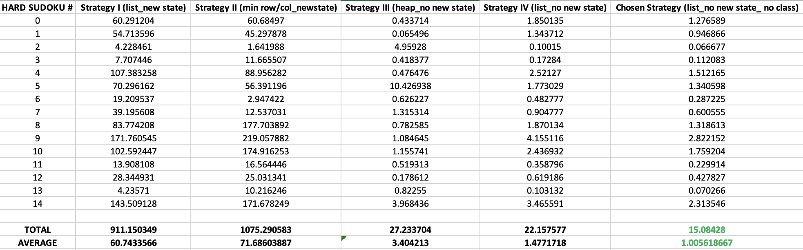

# SUDOKU SOLVER

## Description
The sudoku solver is the implementation of an algorithm which aims to solve an `n x n` sudoku puzzle. In our case, `n = 9`. 
Thus, the solution obtained would comprise a 9x9 sudoku grid where every cell in the board is filled such that the numbers 1 to 9 appear exactly once in each row, column, and 3x3 block of the grid.

Below is a sample sudoku puzzle along with its solution. See the [sudoku.ipynb](./sudoku.ipynb) jupyter notebook for more description details.

<h2 id="algorithm">Algorithm</h2>

A depth-first search algorithm with constraint satisfaction was implemented.

Below is a pseudocode describing the implemented algorithm:

1. Loop through each grid cell and place the (row, column) tuple values of every empty cell in a list of empty cells.

2. Store each value of an occupied cell in dictionaries/hash maps whose value is a set. 3 dictionaries are initialized whose keys are either column, row or 3x3 sub grid values.
   1. The 3x3 sub grid key is obtained by performing an integer division of (row, col) of each cell by square-root of sudoku size of 9. This is so that we can obtain a total of 9 distinct keys, 1 for each subgrid.
   2. A dictionary of sets data structure is chosen so that lookup, insertion and retrieval of values will be done at O(1) time complexity
   3. If a duplicate value is found in any of the row, column or sub grid dictionaries, an invalid 9x9 NumPy array whose values are all equal to -1 is returned. 

3. Perform a depth first search with backtracking on the sudoku grid
   1. If there are no more cells in the empty_cells structure, goal state has been reached. Return current sudoku state.
   2. Choose a value from the list of empty cells to place on the grid. 
      1. In order to maintain O(1) constant time complexity and to easily keep track of what value was chosen, the last value in the array is chosen as can be easily popped and appended in constant time
   3. Loop through the range of digits from 1-9 and if the digit is not in any of the row, column and sub grid dictionaries:
      1. Remove the chosen (row, col) cell from the list of empty cells.
      2. Add the digit to the row, column and sub grid dictionary of seen values.
      3. Perform a recursive search _(repeat step 3)_ on the current state of the sudoku.
      4. If the search returns a sudoku state, this means all cells have been filled, return this state.
      5. Else, backtrack on the current state:
         1. Re-assign the chosen (row, col) cell in the grid to zero.
         2. Append the (row, col) cell to the list of empty cells.
         3. Remove the digit from the row, col and sub grid dictionaries.
         4. Move to the next digit in the range.
         

4. If a valid grid state is returned from the depth first search, return the state. Else, return the invalid 9x9 NumPy array with values all equal to -1

## Other strategies
The algorithm above was implemented in different ways with distinction made in the code structure and the choice of cell selection.

### Previous strategy I [(See code)](./sudoku_approach1_newstate.py)
Here the algorithm was structured using a `PartialSudokuState` class to represent each sudoku state with different instance methods for accessing and modifying the internal state.
The constructor takes in the sudoku grid/board and `n` representing the sudoku shape. Default value for `n` is `9`.
It further initializes the list of empty cells and the row, column and sub grid dictionaries used to store the occupied cell values in a set. As noted earlier, a set is chosen for constant lookup, insertion and retrieval of values.

Similar to the chosen algorithm above, a depth first search algorithm with backtracking is performed on the initial sudoku state. 
The difference with this strategy is that a new partial sudoku state is returned each time when a cell is modified i.e. in the placing of a digit (see `place_digit` method) or reverting of the state during backtracking(see `revert_state` method)
This has the advantage of ensuring immutability of the sudoku states, so the input state is unmodified and each state can be tracked if needed.
However, creating each new partial state requires an additional O(n^2) runtime complexity for the population of its variables.
This is a great disadvantage given that speed is an important factor in the program requirements especially in the hard sudoku category.

See below for a picture of the time spent on a run of each sudoku.
Note that the average time of the hard sudokus is about **1 minute** with the longest running sudoku (#9) running at approximately **3 minutes**.

### Previous strategy II [(See code)](./sudoku_approach2_min_row_col.py)

The second strategy employs a similar class structure and depth first search strategy with major distinction being in determining what cell to place the digit in (see `choose_cell` method).

The strategy involves keeping track of the row and column with the minimum number of empty cells. 
These minimum row and column values are derived in the constructor and then used to select a cell to place digit in the following way:
1. Choose the cell present in the minimum empty row and column if empty.
2. Else, select a random cell (the last cell in this case so that the time complexity is O(1)) from the set of empty cells in the minimum empty row

This choice of cell is considered as that is how I would normally play the sudoku game. I'd first look for the row/column that contains the minimum number of cells to be filled up as perhaps it will be quicker to start filling up the cells this way.
With focus on the hard sudokus, the strategy seemed to perform much faster for some of them (especially the 1st, 4th and 6th sudokus). Actually 8x faster than the previous approach in sudoku 6!

However, it was significantly slower for some of them (sudokus 8, 9, 10, 14); leading to a total time of **1075sec** or **18min** and an average time of about **71sec**.
It performed about 164sec slower in total and about 11 sec slower on average than the previous strategy 1.
Given that speed is of prime importance especially in the hard sudokus, I discarded this approach and looked for an approach that would perform faster.

### Previous strategy III [(See code)](./sudoku_approach3_samestate_heap.py)

The hard sudokus in the previous strategies ran in about a minute on average which is really long - given that the requirements state that _all puzzles must take under 30 seconds each on the test machine to count as successful, but we should be aiming for an average of under a second per puzzle_.

Upon seeking for ways to reduce the time drastically, I realized that much of the time was expended largely by the copying of the grid and creation of new sudoku states whenever a digit is placed or backtracking is performed. (_see strategy 1 for more details_)

This strategy thus sought to eliminate the creation of new states so that depth first search with backtracking is performed on the same sudoku grid.
This strategy further employs a minimum heap strategy in the selection of cells. A minimum heap structure is employed here to easily return the cells contained in the column with minimum number of empty cells:
1. The empty cells list acts as a minimum heap structure where empty cells denoted by (row,col) tuple are pushed into upon initialization of the state via the constructor. This minimum heap serves to return the (row, col) cell contained in the column with the minimum amount of empty cells. This is made possible by the use of a dictionary/map of column to a set of missing rows.
2. This dictionary keeps track of the length of empty rows for each column which can be used as a key when deriving the smallest element in the heap (_see choose_cell method_). Note that this is in contrast with the previous strategy II which uses a row to a set of empty cells dictionary to keep track.

This strategy performed much better than the previous 2 strategies. See results below (_with time in seconds_):

Note that the longest running sudoku (#5) in the hard category takes about **10.4 seconds** which is way less than the requirement of 30 seconds.

However, the average time for the sudokus is about **3 seconds** which is still under the optimal required time of 1 second. Therefore, I continued to try to derive a better result.

Given that the heap structure inserts and retrieves at O(log n) complexity, I decided to replace the minimum heap cell selection strategy with the cell selection strategy of **Strategy I** above which is done at constant O(1) time complexity with the popping and appending of the last element in the empty cells list. 

### Previous strategy IV [(See code)](./sudoku_approach4_samestate_list.py)

This strategy thus combines the mutation of the same state during the recursive search and a selection strategy of the last cell in the empty cells list as discussed above.

This significantly reduced the time for the hard longest running sudoku (#9) to about **4 seconds**. Note that this significantly outperformed the performance of **Strategy I** on the same sudoku #9 which took about **3 minutes** and on average, about **1 minute**. 
Furthermore, sudoku #5 was solved in about 1.8 seconds which is about 6x faster than the previous time taken in **Strategy III**.

The average running time is about **1.48 seconds** which is less than the average of **3 seconds** achieved in the previous **Strategy III**.

See results below:

### Choice of Strategy [(See code)](./sudoku_final_solution.py)

Time spent on the sudokus in the hard category largely influenced the choice of strategy used in the implementation of the sudoku solver algorithm. The best performing strategy (IV) so far performed about 1.48 seconds on average.

Upon further investigation, I realized the construction of the sudoku state object was possibly taking more time than it would take if the algorithm was implemented without a class i.e. using just functions.
This led to the choice of the final strategy which was described in the [Algorithm](#algorithm) section. This outperformed all the other algorithms - incurring an average running time of **1.0 second** in the hard category; with the longest running sudoku (#9) solved in about **2.8 seconds**!

See results below:

I prefer using a class to structure the code as this makes it cleaner but due to speed being the key criteria, the strategy without copying and creating a new partial state on each search, and without structuring into a class is clearly a winner!

See below for comparisons of all the strategies in the hard category (_time in seconds_):

## Future work
The previous strategies had `n` passed into the class's constructor which I suppose should be a perfect square.
I had previously written a method which validates n as a perfect square before attempting to solve the sudoku and throws an error if not a perfect square. However, I removed this piece of code as requirements stated all sudokus would be a 9x9 NumPy array. In the real world, I would leave it in and account for sudokus of more than size 9x9 that contains letters as well. This will be considered as future work if I decide to work on this further.
